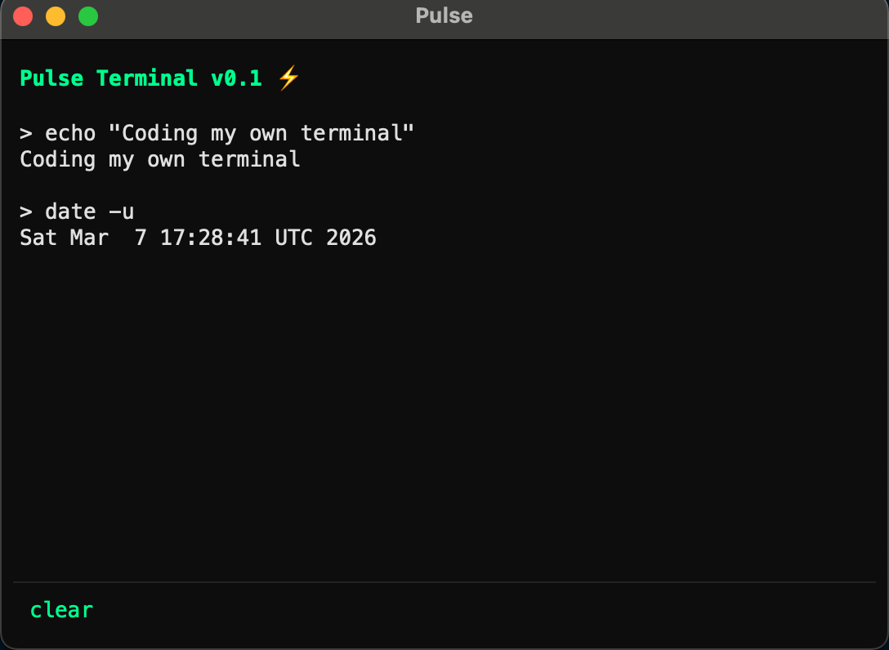
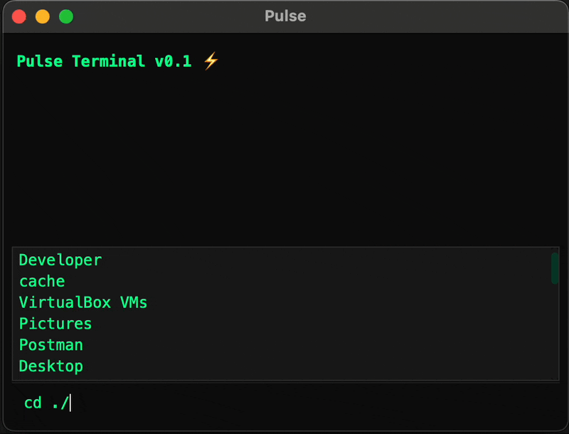
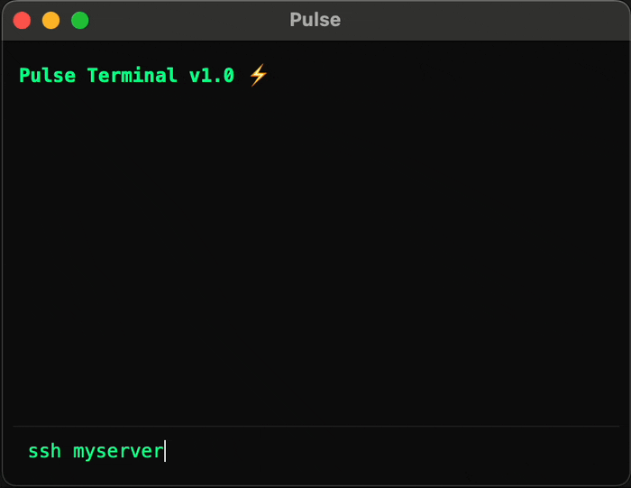

# Pulse Terminal ⚡

A modern, minimal, dark GUI terminal built from scratch in Python using PySide6 — with SSH support, file transfers, screen session management, and smart tab autocomplete for cd.




## Features

### Local Terminal
- PTY-based command execution with real process control
- `cd` navigation with tab autocomplete — handles folder names with spaces
- Live dropdown showing folder contents as you type `/`
- Command history with arrow key navigation
- sudo password masking



### SSH
- Connect via `ssh user@host` or saved nicknames
- Save and manage connections with `ssh-list` and `ssh-delete`
- Remote tab autocomplete with live dropdown
- Drag & drop file or folder to upload to the server
- `upload` — upload a file to the server
- `upload-dir` — upload a full folder to the server
- `download <name>` — download a file or folder from the server
- Conflict resolution on all transfers (overwrite / rename / skip)



### Screen Sessions
- `screen start <name>` — start a named session in a new window
- `screen attach <name>` — reattach a session in a new window
- `screen list`, `screen kill <name>`

### UI
- Dark theme with neon green prompt
- Background color shifts when connected to SSH
- Smooth pulse animation on clear
- Auto-scrollback with manual scroll lock

## Tech Stack
- Python 3.12
- PySide6
- paramiko (SSH/SFTP)

## Installation

Download the latest `.dmg` from [Releases](https://github.com/mointhedev/Pulse-Terminal/releases), open it, and drag **Pulse Terminal** to your Applications folder.

## Run from Source

```bash
pip install PySide6 paramiko
python src/main.py
```

## Author
Moin — [GitHub](https://github.com/mointhedev)
